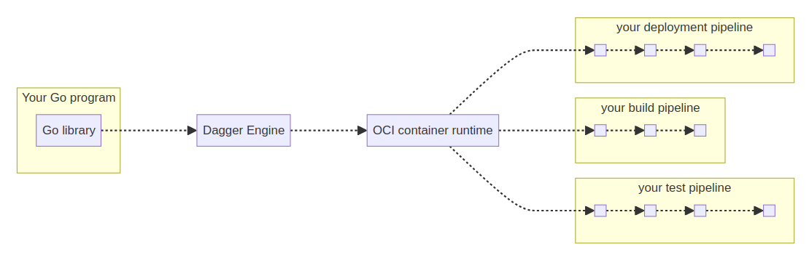

# dagger-101

This repo gives you a quick intro to Dagger, covering the basics and showing how to develop and run a Dagger pipeline for a Rust application, using Go. The content comes from [Dagger's Documentation](https://docs.dagger.io) and Lasse Lund's [*Software Engineering for Data Scientists*](https://lasselundstenjensen.github.io/itu-bds-sdse) course contents at the IT University of Copenhagen.

## Intro

Dagger is a tool that lets you define and run pipelines as code. It works on top of Docker, so your pipelines run in containers. This means you can run them the same way locally or on your preferred CI platform, cutting out the waiting time for CI pipeline executions (woohoo, no last minute surprises!). Plus, Dagger has a caching system that stores everything, making each pipeline run much faster.

## Ecosystem

Dagger is made up of several components that work together to manage the delivery of apps to the cloud:

- **Dagger CLI**: The main tool for interacting with Dagger, usable in the terminal or CI scripts, with a real-time terminal UI for visualization.
  
- **Dagger Functions**: Reusable code blocks that perform tasks like pulling images or copying files, running in containers and supporting multiple languages like Python, Go, and TypeScript.

- **Dagger SDKs**: SDKs for writing Dagger Functions in Go, TypeScript, and Python, with community support for other languages.

- **Dagger API**: A unified GraphQL-based interface for managing pipelines, usually accessed through the CLI or SDKs.

- **Dagger Cloud**: A control plane for managing pipelines with features like visualization, logs, and performance insights.

- **The Daggerverse**: A free service to easily find and use publicly available Dagger Functions.

## How does it work?

According to [older versions of the Go SDK Documentation](https://archive.docs.dagger.io/0.9/sdk/go/):

1. Your Go program imports the Dagger Go library.
2. Using the Go library, your program opens a new session to a Dagger Engine: either by connecting to an existing engine, or by provisioning one on-the-fly.
3. Using the Go library, your program prepares API requests describing pipelines to run, then sends them to the engine. The wire protocol used to communicate with the engine is private and not yet documented, but this will change in the future. For now, the Go library is the only documented API available to your program.
4. When the engine receives an API request, it computes a Directed Acyclic Graph (DAG) of low-level operations required to compute the result, and starts processing operations concurrently.
5. When all operations in the pipeline have been resolved, the engine sends the pipeline result back to your program.
6. Your program may use the pipeline's result as input to new pipelines.

## Dagger Pipeline Implementation

This Dagger pipeline sets up a simple process to build and run a Rust project. Here’s how it works:

- Context creation: it starts by creating a background context to manage the pipeline’s execution.
- Connection to Dagger: the pipeline connects to Dagger’s API, which allows it to interact with containers and files.
- Rust container setup: it pulls the `rust:alpine` image and mounts a local project directory (`hello-rust`) into the container. Then, it checks if Rust is installed by running `cargo --version`.
- Building and running: the working directory is set to `/hello-rust`, and the pipeline runs `cargo r` to build and execute the Rust project.
- Output export: finally, the container’s `output` directory is exported to the host machine.

In order to run this pipeline locally, the command `dagger run go run pipeline.go` should be run on the terminal where the `pipeline.go` file is located.

## GitHub Actions Integration

Here's how the GitHub workflow was set up to integrate with Dagger:

- Pipeline trigger: the pipeline runs whenever there’s a push to the `main` branch, or it can be triggered manually using GitHub’s workflow dispatch.
- Repository checkout
- Go setup: the pipeline sets up Go using `actions/setup-go`, preparing the environment for running Go code.
- Dagger pipeline run: the main step uses the Dagger GitHub Action (`dagger/dagger-for-github`) to execute the pipeline. It specifies:
   - The working directory as the current directory (`.`).
   - The `run` command to trigger the pipeline’s execution.
   - The running arguments `go run pipeline.go` to start the pipeline defined in the Go file.
   - The version of Dagger to ensure compatibility.
